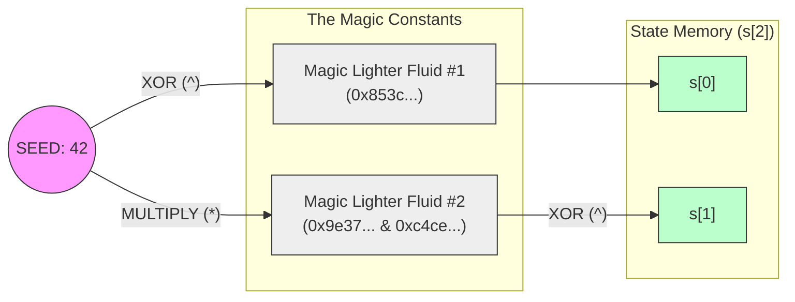
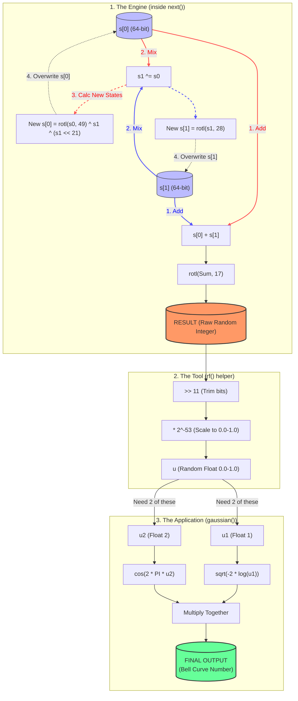

# FastRNG Initialization Explained

This document explains how the `FastRNG` struct initializes its internal state (`s[0]` and `s[1]`) from a single seed value.

## The Problem: Why not just use normal random?
In C++, the standard `rand()` function is like a **Toyota Corolla**.
*   It's reliable and easy to use.
*   **But it's slow.** It does a lot of safety checks and math that takes time.
*   **It's weak.** The quality of randomness isn't great for scientific simulations. (Patterns can repeat).

We are building a **Formula 1 Simulation**.
We need to generate **100 Million random numbers per second** to pack these trees. If we used the Corolla (`rand()`), the simulation would take 3 days. With this custom engine (`FastRNG`), it takes 10 minutes.

## The Concept
We need to turn one simple number (the `seed`, e.g., 42) into two completely different, chaotic 64-bit numbers to start the Random Number Generator. To do this, we use "Magic Constants" (derived from SplitMix64) to scramble the seed in two different ways.

## Visual Flowchart



## The Code Mapping

| Component | Code | Description |
| :--- | :--- | :--- |
| **State 0** | `s[0] = seed ^ 0x853...` | Simple XOR mix to get the first chunk. |
| **State 1** | `s[1] = (seed * 0x9e3...) ^ 0xc4c...` | Multiplicative mix to get a divergent second chunk. |


```cpp
// The "Long Written" Version
uint64_t rotl(uint64_t x, int k) {
    // Step 1: Push beads to the left (some fall off)
    uint64_t left_part = (x << k);
    
    // Step 2: Find the beads that would have fallen off 
    // by looking at the other end (64 - k)
    uint64_t right_part = (x >> (64 - k));
    
    // Step 3: Glue them back together with OR (|)
    return left_part | right_part;
}
```


### Case Study: Cutting 4 Cards (`k=4`)
You want to move the **Top 4** cards to the **Bottom**.

To do this, we perform three steps:

1.  **Left Shift (`x << 4`)**: Take the **Original Deck**. Shove it Left. Keep the **Body** (Bottom 60). The **Top 4** are trashed.
2.  **Right Shift (`x >> 60`)**: Take the **Original Deck**. Shove it Right. Keep the **Top 4**. The **Body** (Bottom 60) is trashed.
**3. The Merge (`|`)**:
*   **Combine:** [Bottom 60 Cards] + [Top 4 Cards]
*   **Result:** The Top 4 are now at the bottom. The deck is rotated!

### Conclusion
*   **Left Shift (`<<`)**: Trashes the **Top 4**.
*   **Right Shift (`>>`)**: Trashes the **Bottom 60**.


We used a precise combination of Spins (rotl), Flips (XOR), and Shoves (<<) to ensure that s[0] and s[1] change unpredictably every single time you call the function.

## The Helper Functions
These convenience tools use the raw output from `next()` to give us useful numbers for the simulation.

| Function | Code | Goal | How it works |
| :--- | :--- | :--- | :--- |
| **`rf()`** | `(next() >> 11) * 0x1.0p-53L` | **Random Fraction** (0.0 to 1.0) | Takes the top 53 bits of a random integer and divides by $2^{53}$ to turn it into a decimal percentage. |
| **`rf2()`** | `rf() * 2.0L - 1.0L` | **Random Range** (-1.0 to 1.0) | Stretches the range: Doubles the fraction (0 to 2), then subtracts 1 (-1 to 1). |
| **`ri(n)`** | `next() % n` | **Random Choice** (0 to n-1) | Uses Modulo (%) to force a huge number into a small container size `n`. |
| **`gaussian()`** | Box-Muller Transform | **Bell Curve** | Uses `log` and `cos` on two random fractions to create numbers that cluster around 0 (small nudges) but occasionally go far (big jumps). |

## Visualizing the Engine
Think of `FastRNG` as a machine with a central engine (`next`) that powers different tools.


